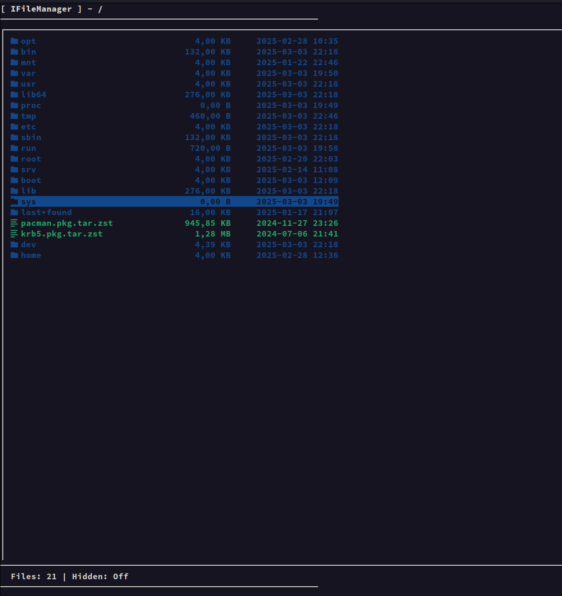
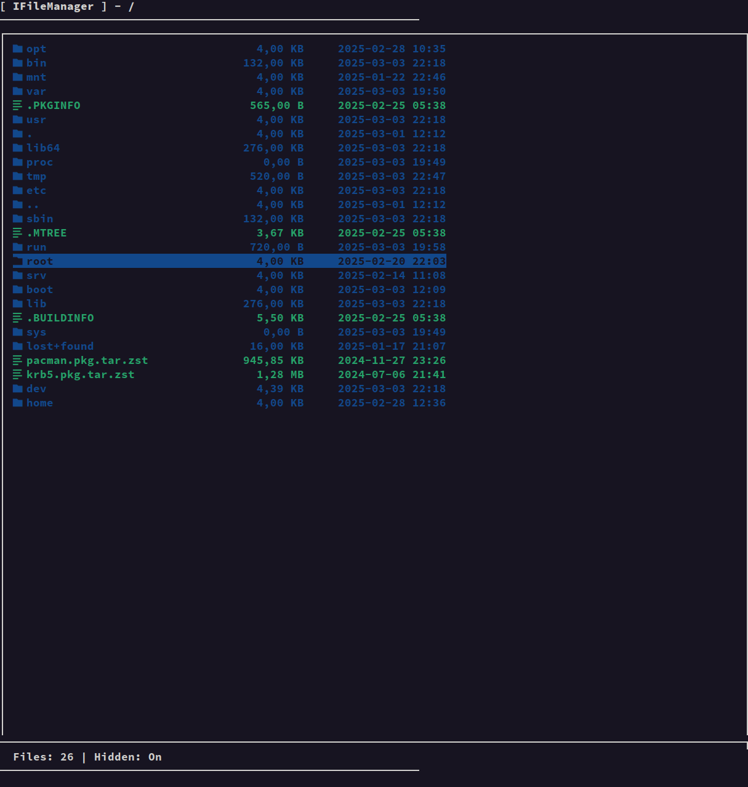

# ifm

ifm - улучшенная версия [cfm](https://github.com/yinmus/cfm.git) в плане UI

**..**
### Сейчас код открывает изображения с помощью `feh`, медиафайлы — через `vlc`, а текстовые файлы и другие документы — в `micro`. Вы можете изменить это под свои нужды.

## Images

  
Не показывает скрытые файлы

  

  
Показывает скрытые файлы

  

